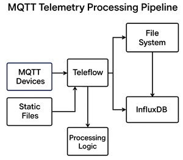

# 🧠 Teleflow Architecture

Teleflow is designed to be a high-performance, modular telemetry pipeline. This document explains how data flows through the system and where you can plug in additional logic or sinks.

---

## 🔄 High-Level Flow

Teleflow can ingest telemetry data from two sources:

- **Live ingestion** via MQTT broker (real-time device data)
- **Static files** (for batch processing or historical imports)

### 📈 Data Flow

```
[MQTT Devices]        [Static Files]
       ↓                     ↓
   MQTT Broker           Teleflow
        ↓                   ↓
     EventLoop   ←──────   /
        ↓
     Buffer
        ↓
   Processing Logic
        ↓
 ┌────────────────┬──────────────────────────┐
 │   File Output  │    Sink (HTTP, InfluxDB) │ 
 └────────────────┴──────────────────────────┘
```

You can run Teleflow in different modes depending on the data source:

- `process-mqtt` — for MQTT ingestion
- `process` — for static file ingestion

---

## 🖼 System Diagram



---

## ⚙️ MQTT Ingestion

- Uses `rumqttc` with async event loop
- Connects to a broker and subscribes to a topic (`telemetry/#`)
- Messages are received and parsed into JSON structures
- Parsed messages are passed to a buffered channel

---

## 🧵 Batching & Buffering

- Incoming messages are stored in an internal buffer (`buffer_size`)
- If the buffer fills or a timeout occurs, a batch is sent for processing
- Batching reduces I/O overhead and improves throughput

---

## 🧮 Processing Stage

- DataFrame is built from the batch using `polars`
- Filters are applied using configuration rules
- Rolling aggregations and other transforms can be applied
- Logging, metrics, and validation can happen here

---

## 💾 Output Writer

- Writes processed data to file (`csv`, `json`, `parquet`)
- Supports batching, disk cleanup, file compression
- Disabled by default via `output.enabled: false`

---

## 🌐 Sink Writer (Optional)

- Sends data to a remote system like InfluxDB or HTTP API
- Works in parallel with file output
- Can be disabled with `sink.enabled: false`

---

## 🧠 Dynamic Concurrency

- Teleflow uses an internal `DynamicSemaphore` to manage load
- Adjusts the number of parallel batches depending on processing speed
- Helps stabilize performance under fluctuating input

---

## 💡 Customization Points

You can extend Teleflow by:

- Adding new sinks (implementing `SinkWriter`)
- Extending processing logic
- Building dashboards based on output